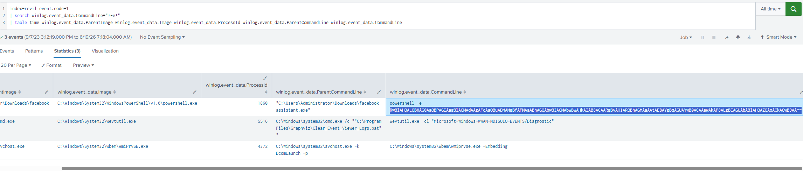
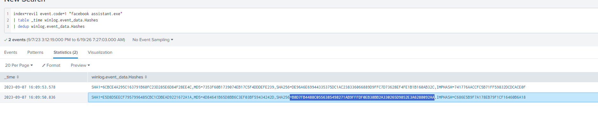
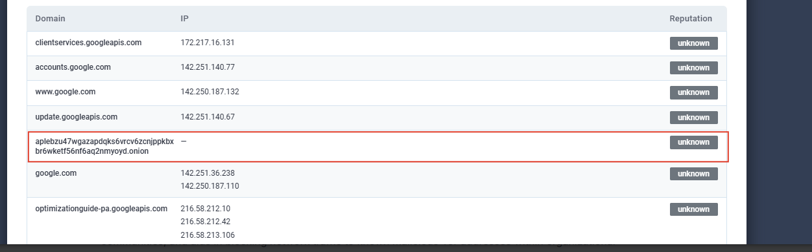

# CyberDefenders REvil Walkthrough

This walkthrough is written in a simple step-by-step format so beginners can follow the investigation without getting lost.

## Lab Info

- Platform: CyberDefenders
- Lab: REvil
- Focus: Ransomware investigation with Splunk and threat intelligence

## Tools Used

- Splunk
- CyberChef
- VirusTotal
- ANY.RUN

## Questions Covered

1. Find the ransom note filename.
2. Identify the ransomware process ID.
3. Find the executable path.
4. Identify the recovery-disruption command.
5. Extract the SHA256 hash.
6. Find the ransomware onion domain.

## Question 1

### Question

To begin your investigation, can you identify the filename of the note that the ransomware left behind?

### Splunk Query

```spl
index=revil event.code=11
| search winlog.event_data.TargetFilename="*\\Downloads\\*"
| table time winlog.event_data.TargetFilename winlog.event_data.ProcessId winlog.event_data.User
```

### Screenshot


### How to solve it

Look at the `TargetFilename` field and focus on files created inside `Downloads` folders. A ransom note often gets copied to multiple user locations.

### Answer

`5uizv5660t-readme.txt`

### Why this is correct

The same text file appears in several `Downloads` folders, which strongly shows that this is the ransom note dropped by the malware.

## Question 2

### Question

After identifying the ransom note, the next step is to pinpoint the source. What's the process ID of the ransomware that's likely involved?

### Splunk Query

```spl
index=revil event.code=11
| search winlog.event_data.TargetFilename="*\\Downloads\\*"
| table time winlog.event_data.TargetFilename winlog.event_data.ProcessId winlog.event_data.User
```

### Screenshot


### How to solve it

Use the same results from Question 1. This time, check the `ProcessId` field beside the ransom note creation events.

### Answer

`5348`

### Why this is correct

All of the ransom note creation events point to process ID `5348`, so that is the process linked to the ransomware activity.

## Question 3

### Question

Having determined the ransomware's process ID, the next logical step is to locate its origin. Where can we find the ransomware's executable file?

### Splunk Query

```spl
index=revil event.code=1
| search winlog.event_data.Image="*\\Downloads\\*"
| table time winlog.event_data.ParentImage winlog.event_data.Image winlog.event_data.ProcessId
```

### Screenshot


### How to solve it

Check the `Image` field for suspicious executables launched from the `Downloads` folder.

### Answer

`C:\Users\Administrator\Downloads\facebook assistant.exe`

### Why this is correct

The `Image` field shows the full path of the executable that ran from `Downloads`, which is the ransomware sample.

## Question 4

### Question

Now that you've pinpointed the ransomware's executable location, let's dig deeper. It's a common tactic for ransomware to disrupt system recovery methods. Can you identify the command that was used for this purpose?

### Splunk Query

```spl
index=revil event.code=1
| search winlog.event_data.CommandLine="*-e*"
| table time winlog.event_data.ParentImage winlog.event_data.Image winlog.event_data.ProcessId winlog.event_data.ParentCommandLine winlog.event_data.CommandLine
```

### Screenshots




### How to solve it

Look for encoded PowerShell in the `CommandLine` field. The `-e` switch suggests base64-encoded content. Copy the encoded string into CyberChef, decode it with `From Base64`, and then decode the text as `UTF-16LE`.

### Answer

```powershell
Get-WmiObject Win32_Shadowcopy | ForEach-Object {$_.Delete();}
```

### Why this is correct

This command deletes Windows Volume Shadow Copies. Ransomware uses this to make file recovery much harder.

## Question 5

### Question

As we trace the ransomware's steps, a deeper verification is needed. Can you provide the sha256 hash of the ransomware's executable to cross-check with known malicious signatures?

### Splunk Query

```spl
index=revil event.code=1 "facebook assistant.exe"
| table _time winlog.event_data.Hashes
| dedup winlog.event_data.Hashes
```

### Screenshots




### How to solve it

Search for the executable name and inspect the `Hashes` field. Copy the `SHA256` value and verify it in VirusTotal to confirm that it matches known malicious activity.

### Answer

`b8d7fb4488c0556385498271ab9fffdf0eb38bb2a330265d9852e3a6288092aa`

### Why this is correct

This hash appears in the Splunk event data and also matches the sample checked in VirusTotal.

## Question 6

### Question

One crucial piece remains: identifying the attacker's communication channel. Can you leverage threat intelligence and known Indicators of Compromise (IoCs) to pinpoint the ransomware author's onion domain?

### Threat Intel Check

Use the sample or its hash in a sandbox or threat-intelligence platform and review network and DNS activity.

### Screenshot



### How to solve it

Review the DNS or network activity and look for suspicious `.onion` domains. These are often linked to ransomware operator portals or payment infrastructure.

### Answer

`aplebzu47wgazapdqks6vrcv6zcnjppkbxbr6wketr56nf6aq2nmyoyd.onion`

### Why this is correct

The sandbox DNS results show a Tor hidden service domain, which is consistent with ransomware infrastructure.

## Final Answers

| Question | Answer |
| --- | --- |
| Ransom note filename | `5uizv5660t-readme.txt` |
| Ransomware process ID | `5348` |
| Executable path | `C:\Users\Administrator\Downloads\facebook assistant.exe` |
| Recovery disruption command | `Get-WmiObject Win32_Shadowcopy \| ForEach-Object {$_.Delete();}` |
| SHA256 hash | `b8d7fb4488c0556385498271ab9fffdf0eb38bb2a330265d9852e3a6288092aa` |
| Onion domain | `aplebzu47wgazapdqks6vrcv6zcnjppkbxbr6wketr56nf6aq2nmyoyd.onion` |
